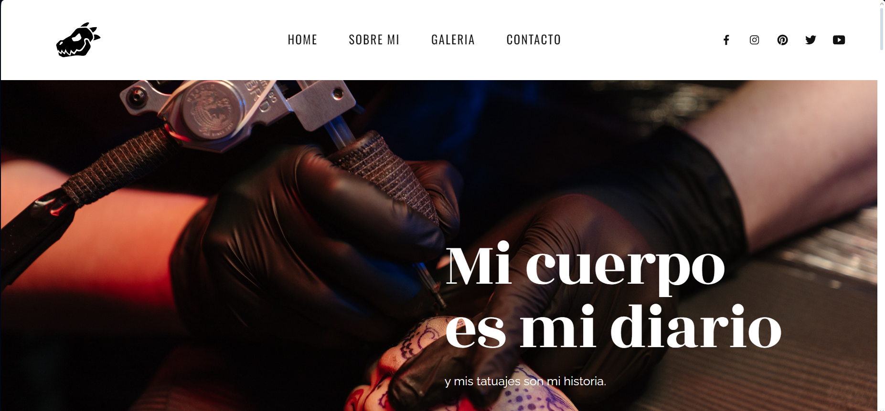

# Cuber Tattoo

## Descripción

Cuber Tattoo es una página web diseñada para mostrar una galería de tatuajes utilizando tecnologías web modernas como React. La página está diseñada para ser visualmente atractiva y fácil de navegar, proporcionando a los usuarios una experiencia agradable mientras exploran diferentes diseños de tatuajes.

### Características

- Galería de tatuajes con imágenes de alta calidad.
- Navegación intuitiva y fácil de usar.
- Diseño responsive para adaptarse a dispositivos móviles y de escritorio.
- Construido con React, lo que permite una estructura modular y un desarrollo eficiente.

## Instalación

1. Clona este repositorio en tu máquina local.
2. Abre una terminal y navega hasta el directorio del proyecto.
3. Ejecuta `npm install` para instalar las dependencias.
4. Ejecuta `npm start` para iniciar la aplicación en modo de desarrollo.

## Licencia

Este proyecto está bajo la Licencia MIT. Consulta el archivo [LICENSE](LICENSE) para obtener más detalles.
